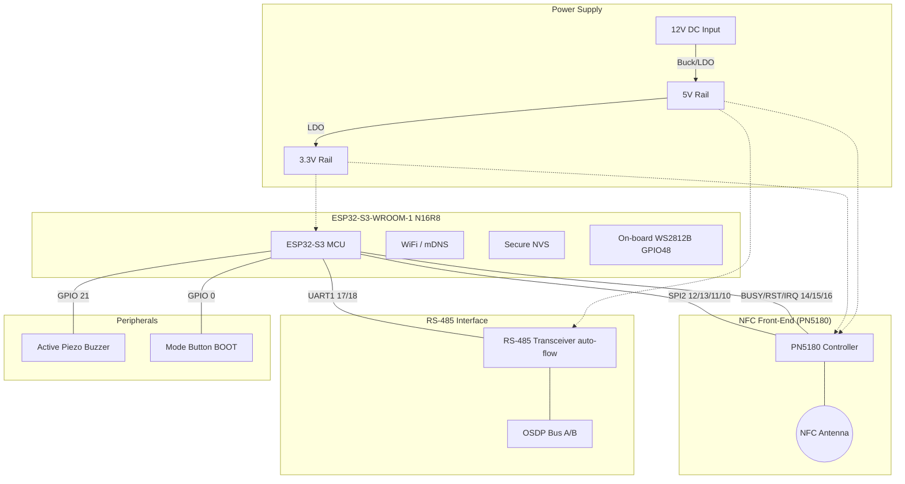

# System Schematic - OSDP LEAF Reader

**Release Version**: v1.5  
**Last Updated**: April 30, 2026

## System Architecture

The system is built around an **ESP32-S3-WROOM-1 N16R8** (44-pin dev board, 16 MB flash, 8 MB PSRAM). It interfaces with an NFC front-end (PN5180 or PN532) via SPI and communicates with a security panel via OSDP over RS-485.

---

## Pinout Definitions

### 1. NFC Interface (PN5180) — primary

| PN5180 Pin | ESP32-S3 GPIO | Description |
| :--- | :--- | :--- |
| **SCK** | GPIO 12 | SPI2 Clock |
| **MISO** | GPIO 13 | SPI2 MISO |
| **MOSI** | GPIO 11 | SPI2 MOSI |
| **NSS (CS)** | GPIO 10 | SPI Chip Select (Active Low) |
| **BUSY** | GPIO 14 | Busy — must be LOW before each command |
| **RST** | GPIO 15 | Hardware Reset |
| **IRQ** | GPIO 16 | Interrupt Request |
| **TVDD** | 5V | TX Driver supply (decouple: 10µF + 100nF) |
| **VCC** | 3.3V | Logic supply |

*Note: 10µF + 100nF decoupling capacitors required at PN5180 TVDD pin to prevent RF dropouts during DESFire writes.*

### 2. NFC Interface (PN532) — alternative

Configure DIP1=OFF DIP2=ON for SPI mode.

| PN532 Pin | ESP32-S3 GPIO | Description |
| :--- | :--- | :--- |
| **SCK** | GPIO 12 | SPI2 Clock (shared bus) |
| **MISO** | GPIO 13 | SPI2 MISO (shared bus) |
| **MOSI** | GPIO 11 | SPI2 MOSI (shared bus) |
| **SS (CS)** | GPIO 10 | SPI Chip Select |
| **IRQ** | GPIO 16 | Interrupt Request |
| **RST** | GPIO 8 | Hardware Reset |

### 3. OSDP / RS-485 Interface

HiLetgo TTL↔RS485 module with automatic flow control (no DE/RE pin required).

| Transceiver Pin | ESP32-S3 GPIO | Description |
| :--- | :--- | :--- |
| **RXD** | GPIO 17 | UART1 TX from ESP → transceiver |
| **TXD** | GPIO 18 | UART1 RX into ESP ← transceiver |
| **A / B** | Terminal | OSDP differential pair to panel |
| **VCC** | 5V | Transceiver power |

### 4. Indicators & IO

| Component | ESP32-S3 GPIO | Notes |
| :--- | :--- | :--- |
| **RGB LED (WS2812B)** | GPIO 48 | On-board — no external hardware needed |
| **Buzzer** | GPIO 21 | Active piezo, HIGH = on |
| **Mode Button** | GPIO 0 | BOOT button, active-low, internal pull-up |

---

## LED Color Scheme

| State | Color | Pattern |
| :--- | :--- | :--- |
| **Idle** (OSDP offline) | Blue | Slow heartbeat blink (1.5 s period) |
| **Armed Read** | Green | Solid |
| **Armed Write** | Amber | Slow blink (0.5 s period) |
| **Access Grant** | Bright Green | 120 ms on + single beep, then off |
| **Access Deny** | Red | 2× 100 ms flash + double beep |
| **Write OK** | Cyan | 3× 80 ms flash + triple beep |
| **Error** | Red | 6× fast flash + continuous beep |

---

## Reserved / Avoided GPIOs

| GPIO Range | Reason |
| :--- | :--- |
| 19, 20 | USB D− / D+ |
| 26 – 32 | Internal octal flash (N16R8) |
| 33 – 37 | PSRAM (N16R8) |
| 43, 44 | UART0 via USB-UART chip (debug console) |
| 0 | BOOT strapping — usable as input after boot |
| 3, 45, 46 | Strapping pins |

---

## Hardware Implementation Notes

1. **Level Shifting**: ESP32-S3 is a 3.3 V device. All peripheral logic must be 3.3 V compatible.
2. **PN5180 TVDD Decoupling**: 10 µF + 100 nF at the TVDD pin is required to prevent RF dropouts during DESFire EV3 write operations.
3. **5 V Rail**: The PN5180 TX driver and RS-485 transceiver both need 5 V. Ensure the 5 V rail is adequately decoupled and can supply ≥ 200 mA peak.
4. **NVS Encryption**: Site keys are stored in NVS. Enable flash encryption in production builds (`CONFIG_FLASH_ENCRYPTION_ENABLED`) — disabled by default in dev builds.
5. **Debug Console**: UART0 is available via the on-board USB-UART chip on GPIO43/44.
