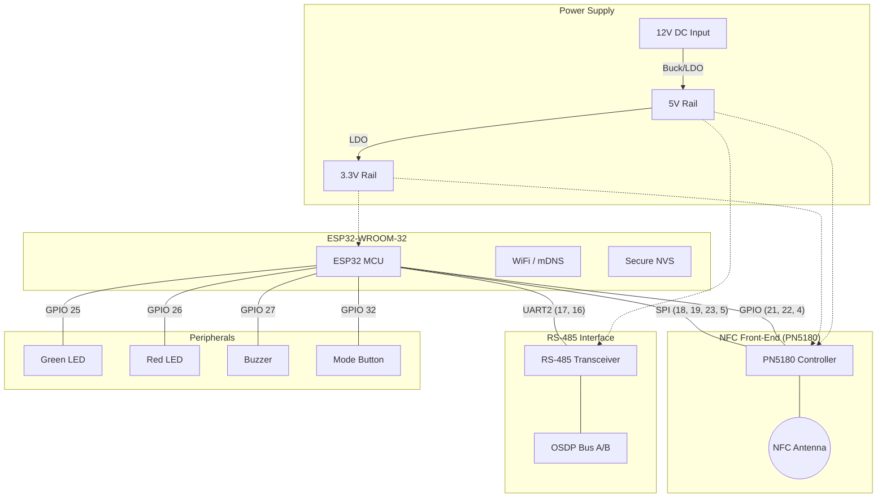

# System Schematic - OSDP LEAF Reader

**Release Version**: v1.4  
**Last Updated**: April 30, 2026

## System Architecture

The system is built around an **ESP32-WROOM-32** module. It interfaces with an NFC front-end (PN5180 or PN532) via SPI and communicates with a security panel via OSDP (RS-485).

---

## Pinout Definitions

### 1. NFC Interface (PN5180)
The PN5180 is the primary NFC controller used for LEAF/DESFire operations.

| PN5180 Pin | ESP32 GPIO | Description |
| :--- | :--- | :--- |
| **SCK** | GPIO 18 | SPI Clock |
| **MISO** | GPIO 19 | SPI Master In Slave Out |
| **MOSI** | GPIO 23 | SPI Master Out Slave In |
| **NSS (CS)**| GPIO 5 | SPI Chip Select (Active Low) |
| **BUSY** | GPIO 21 | Busy Status Signal (High = Busy) |
| **RST**  | GPIO 22 | Hardware Reset |
| **IRQ**  | GPIO 4  | Interrupt Request |
| **VCC**  | 5V / 3.3V | 5V for TX Driver, 3.3V for Logic |

*Note: 10µF + 100nF decoupling capacitors are required at the PN5180 TVDD pin.*

### 2. OSDP / RS-485 Interface
Uses a TTL-to-RS485 transceiver with automatic flow control.

| Transceiver Pin | ESP32 GPIO | Description |
| :--- | :--- | :--- |
| **TXD** | GPIO 17 | UART2 TX (Data to Panel) |
| **RXD** | GPIO 16 | UART2 RX (Data from Panel) |
| **VCC** | 5V / 3.3V | 5V for transceiver, 3.3V for logic side |
| **A / B** | Terminal | OSDP Differential Pair |

### 3. User Interface & IO

| Component | ESP32 GPIO | Configuration |
| :--- | :--- | :--- |
| **Green LED** | GPIO 25 | Active High (Series resistor to GND) |
| **Red LED**   | GPIO 26 | Active High (Series resistor to GND) |
| **Buzzer**    | GPIO 27 | Active Piezo (High = On) |
| **Mode Button**| GPIO 32 | Tactile Switch to GND (Internal Pull-up) |

---

## Legacy NFC Interface (PN532)
If configured for PN532 via Kconfig:

| PN532 Pin | ESP32 GPIO | Description |
| :--- | :--- | :--- |
| **SCK** | GPIO 18 | SPI Clock |
| **MISO** | GPIO 19 | SPI Master In Slave Out |
| **MOSI** | GPIO 23 | SPI Master Out Slave In |
| **SS (CS)** | GPIO 5 | SPI Chip Select |
| **IRQ** | GPIO 4 | Interrupt Request |
| **RST** | GPIO 2 | Hardware Reset |

---

## Hardware Implementation Notes
1. **Level Shifting**: The ESP32 is a 3.3V device. Ensure all peripheral logic is 3.3V compatible.
2. **NVS Encryption**: The system requires the hardware flash encryption to be enabled for secure storage of site keys.
3. **Power**: The PN5180 TX driver can pull ~100mA peaks. Ensure the 5V rail is adequately decoupled.
